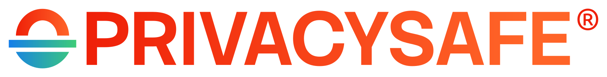

  

<h1 align="center">Identity &amp; Branding</h1>

<h2 align="center">
Get PrivacySafe 👉 <a href="https://privacysafe.app">PrivacySafe.app</a>
</h2>

...

---

## License

© 2019-present <a href="https://ivycyber.com" target="_blank">Ivy Cyber LLC</a>. This project is dedicated to ethical <a href="https://fsf.org" target="_blank" rel="noreferrer noopener">Free and Open Source Software</a> and <a href="https://oshwa.org" target="_blank" rel="noreferrer noopener">Open Source Hardware</a>. Ivy Cyber™ is a pending trademark, PrivacySafe® and 3NWeb® are registered trademarks - do not use these marks without permission from [opensource@ivycyber.com](mailto:opensource@ivycyber.com). All content, unless otherwise noted, is licensed [Creative Commons BY SA 4.0 International](https://creativecommons.org/licenses/by-sa/4.0/).

* PrivacySafe Social banner modifed from artwork by [Pikswell](https://www.deviantart.com/pikswell/art/Retro-wave-Lofi-956577184), [Creative Commons BY 4.0 International](https://creativecommons.org/licenses/by/4.0/) .

* [Stack Sans font family](https://github.com/DylanYoungKoto/Stack-Sans) by Koto Studio, [SIL Open Font License](https://fontesk.com/license/ofl-gpl/).

* [Ubuntu font family](https://fontsource.org/fonts/ubuntu) by Canonical Ltd, [Ubuntu Font Licence](https://canonical.com/legal/font-licence).

* [Bungee font family](https://github.com/djrrb/Bungee) by Bungee Project, [SIL Open Font License](https://fontesk.com/license/ofl-gpl/).

* [Kenney Game Assets](Kenney.nl) by Kenney Vleugels, [Creative Commons Zero Public Domain Dedication](http://creativecommons.org/publicdomain/zero/1.0/)
